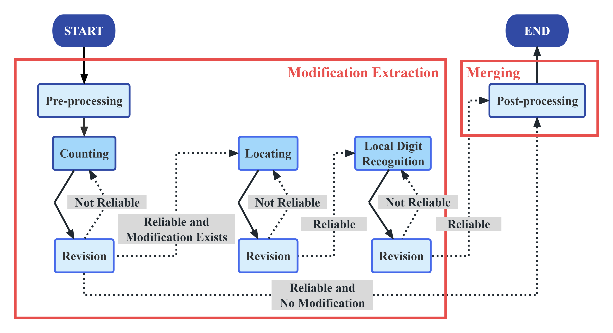

# Handwritten Modification Recognition on Invoices

<p align="center">
  
  
  
  
  
</p>

<p align="center">
  A modular vision-language pipeline for recognizing handwritten modifications on invoices.
</p>

---

## Overview

This project proposes a modular two-stage pipeline for handwritten modification recognition on invoices.

Given:

- an invoice image
- the original invoice content in JSON format

the system automatically:

1. detects handwritten modifications
2. locates modified fields
3. recognizes handwritten digits
4. updates the original JSON content

The pipeline is built on **Qwen3-VL-4B-Instruct**, with **LoRA fine-tuning** applied only to the local digit recognition module.

---

## Pipeline

The inference pipeline consists of:

1. Pre-processing
2. Counting
3. Locating
4. Local Digit Recognition
5. Revision
6. Post-processing

<p align="center">
  
</p>


## Repository Structure

```text
.
├── LoRA/                      # LoRA fine-tuned weights
├── Qwen3-VL-4B-Instruct/      # Base model directory
├── data/                      # Dataset and generated cropping grid files
├── graph/                     # LangGraph-based pipeline
├── prompts/                   # Prompts for pre-processing
├── utils/                     # Utility functions
├── config.py                  # Global configuration
├── download_models.py         # Model download script
├── generate_grid.py           # Cropping grid generation
├── main.py                    # Main inference pipeline
├── model_loader.py            # Model loading utilities
├── requirements.txt           # Python dependencies
├── Inference_Pipeline.png     # Graphical representation of the inference pipeline
├── README.md
└── LICENSE
```

---

## Installation

### Requirements

- Python 3.11+
- CUDA-enabled GPU recommended

### Install dependencies

```bash
pip install -r requirements.txt
```

If `requirements.txt` is unavailable:

```bash
pip install huggingface_hub==1.10.2 langgraph==1.1.10 numpy==2.4.4 opencv_python==4.10.0.84 peft==0.19.1 Pillow==12.2.0 torch==2.6.0 transformers==5.5.4
```

---

## Quick Start

### Run the full pipeline

```bash
python main.py
```

## Model Download

The project uses `Qwen3-VL-4B-Instruct` as the backbone model.

### Option 1: Automatic download

Running the main pipeline automatically downloads the model if it does not exist locally:

```bash
python main.py
```

### Option 2: Manual download

```bash
python download_models.py
```

### Model Path

The default model path can be modified in:

```python
config.py
```

The default model path:

```python
MODEL_DIR = "./Qwen3-VL-4B-Instruct"
```

---

## Generate Cropping Grid

Before running inference on a new invoice format, a cropping grid must be generated once.

Run:

```bash
python generate_grid.py
```

This script:

1. detects table boundaries
2. constructs row-column grids
3. saves grid coordinates as JSON files

Generated grids are stored in:

```text
data/segments/
```

---

## Data

The `data/` directory contains:

- invoice images
- original invoice JSON files
- cropping grids
- 
---

## LoRA Fine-tuning

LoRA fine-tuning is applied only to the local digit recognition module.

### Configuration

| Parameter | Value |
|---|---|
| Base Model | Qwen3-VL-4B-Instruct |
| LoRA Rank | 8 |
| Alpha | 16 |
| Epochs | 5 |
| Learning Rate | 5e-5 |

The LoRA weights are stored in:

```text
LoRA/
```

---

## Adaptation to New Invoice Formats

The pipeline is designed for easy extension to new invoice layouts.

To support a new invoice format:

1. generate a new cropping grid using `generate_grid.py`
2. add format-specific post-processing rules if necessary

No modification to the core inference pipeline is required.

---

## Citation

```bibtex
@misc{invoice_handwriting_project,
  title={Handwritten Modification Recognition on Invoices Using a VLM-Based Modular Pipeline},
  author={Yuchen Li and Hongyi Shen and Yiwei Tong and Wenpei Xu and Wei Zhao},
  year={2026}
}
```

---

## License

This project is released under the MIT License.
